# SharedAutonomy-VLA

> 面向真实机器人操作的共享控制辅助示教、模仿学习与 VLA 纠错微调闭环  
> Shared-Autonomy-Assisted Demonstration Collection and Corrective VLA Fine-Tuning for Real-Robot Manipulation

## 项目状态

- 当前阶段：**Week 1 / 硬件、数据与最小训练闭环**
- 计划周期：**4–6 周**
- 主要平台：无独显 Windows 控制机 + RM-65B + 腕部 RGB-D / 固定第三视角 RGB 相机 + SpaceMouse + 二指软夹爪
- 主要训练资源：Ubuntu 22.04 GPU 服务器，2 × RTX 3090，64 GB RAM
- 目标：在真实机械臂上跑通从数据采集到策略部署、人工纠错和再次微调的完整链路
- 详细进度：[项目路线图](docs/roadmap.md) · [每日计划与日志](docs/daily/) · [最近工作日志](docs/daily/2026-07-23/log.md)

---

## 1. 项目简介

本项目研究一个具体问题：

> **局部、结构化且不能独立完成完整任务的共享控制辅助，能否提高人类示教数据的采集效率和质量，并进一步提升 ACT/VLA 等端到端机器人策略的学习效果？**

项目将搭建一个真实机器人数据闭环：

1. 操作者阅读任务指令，并通过 SpaceMouse 遥操作机械臂；
2. 共享控制模块根据人类控制指令推断当前目标，提供局部趋近、安全约束和动作修正；
3. 系统同步记录图像、机器人状态、人类动作、辅助动作和最终执行动作；
4. 使用采集数据训练任务条件 ACT 基线和小型 VLA；
5. 将策略部署到真实机械臂；
6. 在策略失败时由人类接管并完成恢复；
7. 将纠错轨迹重新加入数据集，再次微调模型。

最终目标不是保留人在控制回路中，而是使用共享控制系统作为**高质量训练数据的生产工具**，训练可以根据视觉、语言和机器人状态自主完成任务的策略。

---

## 2. 核心概念：两个策略不在同一层级

本项目包含两类不同的机器策略。

### 2.1 数据采集阶段的局部辅助器

局部辅助器只负责：

- 候选目标方向上的局部趋近；
- 工作空间边界和桌面碰撞约束；
- 末端运动平滑和速度限制；
- 接近目标后的夹爪开合辅助；
- 根据意图置信度和人机冲突动态调整辅助强度。

它**不能独立完成完整任务**，也不直接读取任务的真实语言标签。

### 2.2 最终学习得到的 ACT/VLA 策略

最终策略需要独立完成完整任务：

```text
视觉观测 + 任务条件/语言指令 + 机器人状态
                        ↓
              机械臂与夹爪动作序列
```

因此，局部辅助器是数据采集阶段的“脚手架”，ACT/VLA 是拆掉脚手架后执行完整任务的自主策略。

---

## 3. 任务定义

### 3.1 主任务：语言条件的多目标抓取放置

桌面上放置三种不同颜色的木块和两个放置区域。

```text
source_object ∈ {red, blue, yellow}
destination   ∈ {left, right}
```

共包含 6 种基础任务，例如：

- Pick up the red block and place it in the left region.
- Pick up the blue block and place it in the right region.
- Pick up the yellow block and place it in the left region.

### 3.2 第一阶段动作空间

为降低 4–6 周内的实现风险，第一阶段采用低维连续动作：

```text
action = [Δx, Δy, Δz, gripper_angle]
```

初期保持末端姿态固定。项目稳定后，再考虑加入：

- 末端姿态控制；
- 更复杂的抓取方向；
- 灵巧手低维手型或 synergy；
- 触觉信息。

### 3.3 任务随机化

训练与测试中逐步加入：

- 木块初始位置随机化；
- 放置区位置小范围随机化；
- 不同背景和光照；
- 未见位置组合；
- 可选的中途目标切换。

---

## 4. 硬件与计算资源

### 4.1 机器人平台

- RealMan RM65 六自由度机械臂，用户设备标识为 RM65-6F，控制器自报 `force_type=6FB` 一体化六维力版本；
- 可连续控制开合角度的二指软夹爪；
- 腕部 RGB-D 相机，用于目标局部 XYZ 精定位与抓取观察；
- 固定安装的第三视角 RGB 相机，用于全局观测、模型视觉输入和桌面 XY 粗定位；
- 3Dconnexion SpaceMouse；
- 可选扩展：三指/五指灵巧手及触觉传感。

第三视角相机应在正式采集、训练测试和部署期间保持固定的安装位置、画面范围、分辨率、曝光和白平衡。若它为共享控制提供目标位置，应通过桌面平面单应性完成像素到机器人桌面 XY 坐标的映射；若只作为 ACT/VLA 的 RGB 输入，则不以精确机器人外参标定为前置条件。

### 4.2 Windows 控制机

Windows 控制机无独立 GPU，承担所有与硬件直接相连且必须本地完成的工作：

- RM-65B、夹爪、SpaceMouse 与双相机连接；
- 人工遥操作、共享控制融合与本地安全过滤；
- 传感器时间同步、原始 episode 记录与数据校验；
- 在自主部署时接收策略动作，并保留最终执行权与人工接管权。

这些采集与控制工作应尽量保持 CPU 可实时运行，不依赖 GPU 服务器在线。

### 4.3 Ubuntu GPU 服务器

- Ubuntu 22.04；
- 2 × NVIDIA RTX 3090；
- 64 GB RAM。

两张 3090 主要用于：

- ACT 多次训练和数据消融；
- 小型 VLA 的 LoRA/参数高效微调；
- 双卡数据并行；
- 真机推理前的离线验证。

Manual / SharedAutonomy 数据采集只需要 Windows 控制机；离线训练时将完整 episode 从 Windows 复制到服务器。只有 ACT/VLA 真机自主部署时，服务器才通过有线局域网提供推理结果；机器人底层控制、安全检查和人工接管始终保留在 Windows 本地。

---

## 5. 系统架构

```mermaid
flowchart LR
    subgraph Windows[Windows Robot Host - no discrete GPU]
        T[Task instruction] --> H[Human operator]
        H -->|SpaceMouse command| I[Intent inference]
        H -->|Human action| A[Arbitrator]

        C[Wrist RGB-D + fixed external RGB] --> O[Synced observation]
        Robot[RM-65B + gripper] --> S[Robot state]
        S --> O

        I --> L[Local assist policy]
        L -->|Assist action| A
        I -->|Belief / confidence| A
        A --> SF[Local safety supervisor]
        SF -->|Executed action| Robot

        O --> R[Dataset recorder]
        H -->|Human action| R
        L -->|Assist action| R
        SF -->|Executed action / authority| R
        T --> R

        O --> PC[Policy client]
        PC -->|Suggested policy action| SF
    end

    R --> D[LeRobot-style dataset]

    subgraph Ubuntu[Ubuntu GPU Server]
        Train[ACT / VLA training and analysis]
        Infer[ACT / VLA inference service]
    end

    D -->|Offline dataset transfer| Train
    PC <-->|Wired LAN: observations / action chunks| Infer

    Infer --> E[Real-robot evaluation]
    E -->|Failure| X[Human intervention]
    X --> CD[Corrective demonstrations]
    CD --> D
```



---

## 6. 数据采集模式

### 6.1 Manual Teleoperation

纯人工遥操作：

```text
a_executed = a_human
```

用途：

- 建立无辅助基线；
- 验证硬件与数据同步；
- 量化共享控制是否提高采集质量。

### 6.2 SharedAutonomy

共享控制辅助采集：

```text
a_executed = arbitration(
    a_human,
    a_assist,
    intent_belief,
    safety_state
)
```

共享控制器不直接读取真实任务标签，而是根据：

- SpaceMouse 输入；
- 当前机器人状态；
- 候选目标位置；
- 人类动作与候选辅助动作的一致性；

推断操作者意图，并只提供局部辅助。

### 6.3 Corrective Demonstration

自主策略部署后，操作者在失败前或失败过程中接管：

```text
AUTONOMOUS
    ↓
HUMAN_INTERVENTION
    ↓
RECOVERY
    ↓
SAVE_CORRECTIVE_EPISODE
```

纠错轨迹用于后续再次微调。

---

## 7. 数据格式

每条 episode 至少保存以下信息。

### 7.1 任务信息

```yaml
task_id: 0
task_text: "Pick up the red block and place it in the left region."
source_object: red
destination: left
success: true
collection_mode: manual | shared_autonomy | corrective
```

### 7.2 观测

```yaml
observation:
  external_rgb: ...
  wrist_rgb: ...
  joint_position: ...
  end_effector_pose: ...
  gripper_angle: ...
```

### 7.3 动作与共享控制状态

```yaml
action:
  human: [dx, dy, dz, gripper]
  assist: [dx, dy, dz, gripper]
  executed: [dx, dy, dz, gripper]
  policy: [dx, dy, dz, gripper]   # 部署与纠错阶段

shared_control:
  authority: ...
  intention_belief: ...
  inferred_target: ...
  human_assist_conflict: ...
  safety_intervention: ...
  intervention_mask: ...
```

必须同时保存 `human`、`assist` 和 `executed` 三路动作。训练时主要监督与真实状态转移一致的 `executed` 或人工纠错动作，其他动作保留用于分析和消融。

---

## 8. 策略路线

## 8.1 ACT 基线

ACT 使用结构化任务条件：

```text
external_rgb
+ wrist_rgb
+ robot_state
+ object_id
+ destination_id
        ↓
task-conditioned ACT
        ↓
action chunk
```

任务条件建议因子化编码：

```text
object_id      ∈ {red, blue, yellow}
destination_id ∈ {left, right}
```

而不是只使用不可拆分的 6 类 task ID。

计划训练：

- `ACT-Manual`
- `ACT-SharedAutonomy`

ACT 的主要作用：

- 快速验证数据、动作和时间同步；
- 比较 Manual 与 SharedAutonomy 数据质量；
- 作为稳定、低成本的模仿学习基线；
- 在 VLA 训练失败时保证项目仍有完整成果。

## 8.2 小型 VLA

VLA 直接使用自然语言：

```text
external_rgb
+ wrist_rgb
+ robot_state
+ task_text
        ↓
small VLA / LoRA fine-tuning
        ↓
action chunk
```

计划训练：

- `VLA-Manual`
- `VLA-SharedAutonomy`
- `VLA-SharedAutonomy-Corrective`

当前优先考虑能够在单张 24 GB 显卡上完成微调的小型 VLA。具体模型和版本在完成训练 smoke test 后确定。

---

## 9. 主要研究问题

### RQ1：共享控制是否提高示教采集效率？

比较 Manual 和 SharedAutonomy：

- 单位时间内成功演示数量；
- 原始 episode 成功率；
- 平均完成时间；
- 轨迹长度；
- 动作平滑度；
- 人机冲突；
- 人工修正次数。

### RQ2：共享控制数据是否更适合训练策略？

在相同成功演示数量下比较：

- ACT-Manual vs. ACT-SharedAutonomy；
- VLA-Manual vs. VLA-SharedAutonomy。

主要指标：

- 真机任务成功率；
- 完成时间；
- 最终放置误差；
- 动作平滑度；
- 失败类型；
- 对随机初始位置的泛化。

### RQ3：纠错数据是否能够修复部署失败？

比较：

- `VLA-SharedAutonomy`
- `VLA-SharedAutonomy-Corrective`

主要指标：

- 原有失败类型的复现率；
- 人工接管率；
- 纠错前后成功率；
- 是否引入新的性能退化。

### RQ4：ACT 与 VLA 的能力边界是什么？

ACT 获得结构化任务条件，VLA 获得自然语言指令。重点分析：

- 小数据条件下的训练稳定性；
- 已见任务组合表现；
- 未见位置和指令表达；
- 可选的组合泛化测试。

---

## 10. 评测协议

### 10.1 基础任务

6 个任务组合，每个组合使用若干固定测试配置和随机配置。

### 10.2 推荐测试集合

- Seen configuration：训练分布内的位置；
- Position generalization：未见物体位置；
- Instruction paraphrase：VLA 使用不同语言表达；
- Optional composition holdout：保留一个物体—目标区域组合只用于测试；
- Optional intention switch：任务执行中途改变目标。

### 10.3 公平性原则

- Manual 与 SharedAutonomy 使用相同任务分布；
- 相同数据量和相同采集时间分别比较；
- 测试场景和随机种子保持一致；
- 明确区分成功演示、失败演示和纠错演示；
- 报告原始采集成本，而不只报告清洗后的数据规模；
- 辅助器不得直接访问真实任务标签。

---

## 11. 仓库结构

```text
sharedautonomy-vla/
├── README.md
├── LICENSE
├── pyproject.toml
├── configs/
│   ├── robot/
│   ├── collection/
│   ├── policy/
│   └── evaluation/
├── sharedautonomy/
│   ├── robot/
│   │   ├── rm65.py
│   │   ├── gripper.py
│   │   └── safety.py
│   ├── devices/
│   │   ├── spacemouse.py
│   │   ├── wrist_camera.py
│   │   └── external_camera.py
│   ├── perception/
│   │   ├── target_detection.py
│   │   └── workspace_calibration.py
│   ├── intent/
│   │   ├── belief.py
│   │   └── target_inference.py
│   ├── assistance/
│   │   ├── local_approach.py
│   │   ├── safety_filter.py
│   │   └── authority.py
│   ├── control/
│   │   ├── manual.py
│   │   ├── shared_autonomy.py
│   │   └── intervention.py
│   ├── data/
│   │   ├── recorder.py
│   │   ├── schema.py
│   │   ├── validator.py
│   │   └── visualization.py
│   ├── policies/
│   │   ├── act/
│   │   └── vla/
│   └── evaluation/
│       ├── rollout.py
│       ├── metrics.py
│       └── benchmark.py
├── scripts/
│   ├── collect_manual.py
│   ├── collect_shared.py
│   ├── train_act.py
│   ├── train_vla.py
│   ├── rollout_policy.py
│   └── collect_corrections.py
├── tests/
│   ├── test_action_transform.py
│   ├── test_dataset_schema.py
│   ├── test_time_sync.py
│   └── test_safety_filter.py
├── docs/
│   ├── roadmap.md
│   ├── daily/
│   ├── decisions/
│   ├── engineering_conventions.md
│   └── hardware_setup.md
└── assets/
    ├── setup.jpg
    ├── architecture.png
    └── demos/
```

---

## 12. 项目进度与文档导航

README 只维护长期稳定的项目说明。阶段目标、每日执行清单和历史记录分别维护在：

- [项目路线图](docs/roadmap.md)：4–6 周阶段目标、当前进度和验收标准；
- [每日计划与日志](docs/daily/)：每日工作流程、模板和日期索引；
- [2026-07-23 工作计划](docs/daily/2026-07-23/plan.md)：首日执行清单；
- [2026-07-23 工作日志](docs/daily/2026-07-23/log.md)：首日实验结果、结论和下一工作日建议；
- [硬件配置与测试结论](docs/hardware_setup.md)：硬件能力、延迟、安全验证和本机配置边界；
- [工程约定](docs/engineering_conventions.md)：代码风格、日志、配置和测试要求；
- [架构决策记录](docs/decisions/)：需要长期追溯的重要接口和设计决策。

第一条目标链路仍为：

```text
SpaceMouse
    → human action
    → safety filter
    → RM-65B
    → synchronized observation
    → dataset recorder
    → replay / visualization
```

---

## 13. 安全要求

真实机器人实验必须满足：

- 设置机械限位和软件工作空间；
- 限制末端单步位移和速度；
- 真机运动期间控制端软件急停必须常驻可用，操作员必须在场；若增加实体急停，必须采用与实际控制器代际匹配的方案；
- 夹爪闭合角度和速度受限；
- 数据采集开始前执行复位检查；
- 训练策略初次部署使用低速模式；
- 策略输出必须经过安全过滤器；
- 所有自动 rollout 需要操作员在场；
- 未验证策略不得在人员手部附近运行。

---

## 14. 风险与降级方案

### 风险 1：抓取任务不稳定

降级为：

1. 多目标 reaching；
2. 固定姿态抓取；
3. 单物体抓取；
4. 完成后再恢复多任务设置。

### 风险 2：VLA 微调时间不足

保留：

- 完整 ACT 结果；
- VLA 离线训练与少量真机演示；
- VLA 作为 Week 4–5 扩展，而不是项目成立前提。

### 风险 3：共享辅助过强

控制辅助器只提供局部修正，并报告：

- 平均 authority；
- 人机冲突；
- 辅助器单独执行能力；
- 不同辅助强度；
- 人类对完整任务的实际贡献。

### 风险 4：灵巧手接入耗时

二指软夹爪始终是主线。灵巧手只作为接口兼容和低维手型扩展，不阻塞 MVP。

### 风险 5：数据量不足

优先增加：

- 初始位置变化；
- 失败边界附近的数据；
- 策略部署后的纠错轨迹；

而不是盲目增加完全重复的成功轨迹。

---

## 15. 最终交付物

项目完成时应至少包含：

- 可公开 GitHub 仓库；
- 清晰 README 和系统架构图；
- RM-65B/SpaceMouse/双相机数据采集接口；
- Manual 与 SharedAutonomy 数据集示例；
- 数据检查和可视化工具；
- ACT 训练与部署脚本；
- 小型 VLA 微调与部署脚本；
- 人工接管和纠错数据闭环；
- 真机演示视频；
- 定量实验表格和曲线；
- 失败案例分析；
- 可复现的配置文件和运行说明。

---

## 16. 非目标

在当前 4–6 周周期内，以下内容不属于必做项：

- 从零训练大型 VLA；
- 完整复现 DexVLA 或 π 系列模型；
- 高保真 RM-65B Isaac Lab 数字孪生；
- 大规模人类受试者实验；
- 复杂装配、叠衣服等长时序任务；
- 从零开发高自由度灵巧手控制栈；
- 同时完成 ACT、Diffusion Policy、多个 VLA 和强化学习的大规模横向比较。

项目优先级始终是：

```text
真实机器人数据闭环
> 共享控制数据价值
> ACT 稳定基线
> 小型 VLA 微调
> 纠错再训练
> 额外模型和仿真
```

---

## 17. 预期项目结论

本项目不预设 SharedAutonomy 一定优于 Manual。期望通过可复现实验回答：

1. 共享控制是否在相同采集时间下产生更多成功演示？
2. 共享控制生成的轨迹是否更平滑、更安全或更容易学习？
3. 相同数据量下，使用共享控制数据训练的策略是否表现更好？
4. 人工纠错数据是否能够有效修复特定失败模式？
5. ACT 与小型 VLA 在小规模真实机器人数据上的优势和边界分别是什么？

无论结果是否完全符合预期，都应公开失败案例和限制，避免只展示成功视频。

---

## 18. License

待确定。若无实验室或第三方代码限制，建议代码使用 Apache-2.0 或 MIT License；数据集、模型权重和硬件驱动需要分别确认授权条件。

---

## 19. Citation

项目形成稳定版本后补充引用信息。共享控制模块将注明其与既有人机共享控制研究的关系，外部框架、模型和数据格式按各自许可证与论文要求引用。
