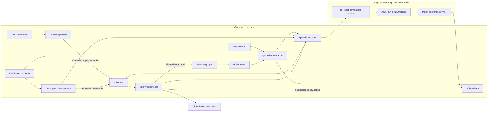

# SharedAutonomy-VLA Overview

Language: English | [简体中文](overview.zh-CN.md)

SharedAutonomy-VLA is a real-robot system for studying whether weak, local shared-control assistance can produce better training data and better learned robot policies than manual teleoperation alone.

The public method is:

```text
human demonstration (manual or assisted)
        → structured episode data
        → task-conditioned policy training
        → closed-loop real-robot evaluation
```

The project is intentionally an engineering and methodology study, not a claim that a simple cube task requires a VLA or that shared autonomy is universally better than manual control.

## 1. Project focus

The central question is:

> Under a matched demonstration budget and training recipe, can local shared-autonomy assistance improve the closed-loop performance of a policy trained from real-robot demonstrations?

The system keeps the human in charge of task-level motion and gripper control. Assistance is deliberately narrow: it aligns the tool with the target cube's yaw and does not independently execute the complete pick-and-place task. This makes the assisted collector a data-collection scaffold rather than the final policy.

The benchmark is deliberately controlled. A conventional vision-and-control stack can solve this type of task, so success on the task is not presented as evidence that learning is necessary. The value of the project is the complete, inspectable path from teleoperation and safety filtering to structured data, policy training, deployment, and paired comparison.

## 2. Public mainline

| Stage | Human role | Machine role | Purpose |
| --- | --- | --- | --- |
| Manual collection | Controls Cartesian motion and gripper | No yaw assistance | Data and hardware baseline |
| Shared-autonomy collection | Controls Cartesian motion and gripper | Estimates cube yaw and overlays local J6 alignment | Main assisted-data condition |
| Learned-policy evaluation | No human action in the nominal loop | SmolVLA predicts actions from observations and task text | Tests whether the data supports autonomous execution |

The shared-autonomy collector uses the external camera to estimate the cube's initial wrap-90 yaw. During collection, the yaw assistant proposes a bounded J6 overlay while the human retains control of translation and the gripper. Human override, deadman state, gripper state, confidence, authority, and safety interventions are recorded as episode data.

The runtime schema also supports corrective episodes, but corrective retraining is an extension of the pipeline and is not part of the locked Manual-versus-Shared-Autonomy result.

## 3. Task and locked comparison

The public result uses the `shape_pick_place_v1` task family in its `block_rotation_rq2` evaluation variant:

```text
instruction: Pick up the red cube and place it in the UP region.
```

The locked comparison is a 36-condition paired real-robot grid. The complete condition matrix, training comparison, hard-success rule, and outcome analysis are maintained in [`results.md`](results.md) and [`results.json`](results.json); the source dataset facts and training recipe are maintained in [`datasets.md`](datasets.md) and [`training.md`](training.md). This overview keeps only the public method and architecture rather than repeating the result tables and adjudication rules.

## 4. System architecture



The robot host owns hardware access, observation synchronization, arbitration, safety filtering, and the final command sent to the robot. Training and optional policy inference can run on a separate compute host; the lower-level safety path remains local to the robot host.

## 5. Runtime data contract

Each episode records enough information to distinguish what the human requested, what the assistance policy proposed, and what the robot actually executed:

- synchronized wrist and external camera observations;
- robot state, including joint position, end-effector state, and gripper state;
- `human` action;
- `assist` action and confidence;
- safety-filtered `executed` action, authority, and intervention reasons;
- task text, collection mode, timestamps, effective configuration, schema version, and source commit when available.

The native recorder preserves physical-space actions and timing information. The training export maps the recorded episode into the policy dataset format. The public overview keeps this distinction explicit; the reader-facing dataset contract and lineage are summarized in [`datasets.md`](datasets.md).

## 6. Policy route

ACT is retained as an early imitation-learning baseline and pipeline support path. The locked public comparison uses SmolVLA because it provides the language-conditioned policy route used for the Manual and Shared-Autonomy checkpoints.

At deployment, the learned policy receives visual observations, task text, and robot state, then proposes an action sequence. The robot host applies the same safety supervision used by the rest of the system before sending commands to the hardware. The goal is to evaluate the policy after removing the human from the nominal control loop.

## 7. Hardware boundary and safety

The validated platform uses an RM65-class robot, two cameras, a SpaceMouse, and separate Windows robot and Linux GPU hosts. Public hardware roles, host responsibilities, timing assumptions, and the complete safety boundary are maintained in [`hardware.md`](hardware.md). Machine-specific values remain in local configuration and private commissioning notes. Motion is disabled by default and any physical execution path still requires both motion gates and an operator-controlled emergency-stop path.

## 8. Scope and limitations

The fixed one-task grid does not establish universal superiority, causal improvement, repeatability, broad generalization, or a completed corrective-demonstration result. Detailed evaluation limits, negative results, and the public/private boundary are maintained in [`limitations.md`](limitations.md). Private code, raw notes, machine paths, and intermediate checkpoints are not part of the public mainline.

## 9. Public implementation points

The main implementation surfaces are:

- [`cube_yaw_assist.py`](../sharedautonomy/assistance/cube_yaw_assist.py): bounded local J6 yaw assistance;
- [`safety_filter.py`](../sharedautonomy/assistance/safety_filter.py): safety supervision;
- [`schema.py`](../sharedautonomy/data/schema.py): typed observation, action, and episode interfaces;
- [`recorder.py`](../sharedautonomy/data/recorder.py): native episode recording;
- [`policies/smolvla/`](../sharedautonomy/policies/smolvla/): SmolVLA runtime interfaces;
- [`results.json`](results.json): locked public evaluation protocol and aggregate results.

The code is released under the MIT License. Datasets, model checkpoints, upstream model weights, and media may carry separate licenses and attribution requirements; those terms must be resolved in their release metadata rather than inferred from the code license.
