# 项目背景与系统设计

本文档维护 SharedAutonomy-VLA 的长期稳定说明：研究问题、任务定义、系统架构、数据格式、评测协议与交付物。阶段进度见 [roadmap.md](roadmap.md)；采集与导出快照清单见 [datasets.md](datasets.md)；每日执行见 [daily/](daily/)；硬件验证见 [hardware_setup.md](hardware_setup.md)。

---

## 1. 项目简介

### 1.1 核心问题

本项目研究一个具体问题：

> **局部、结构化且不能独立完成完整任务的共享控制辅助，能否提高人类示教数据的采集效率和质量，并进一步提升 ACT/VLA 等端到端机器人策略的学习效果？**

### 1.2 项目出发点（范式定位）

本项目首要交付的是一条**可外推的真实机器人闭环**，而非在简化任务上追求抓取 SOTA：

```text
人类示教（可选局部共享控制）→ 结构化数据 → ACT / 小型 VLA → 真机部署（可选纠错再训）
```

**为何用色块语言条件抓放作为试验床**

- 现场任务（红/蓝/黄 × 放置区、英文 `task_text`）成功判据清晰，对照实验好做，与已采集 C0/C1 及 ACT/SmolVLA 实验一致。
- 色块识别 + 笛卡尔规则控制在本任务上**往往优于**当前 ACT/SmolVLA；项目明确知道规则基线更强，并保留其作为对照。
- 简单任务承担的是 **LunarLander 式范式验证**：环境可控、管线可跑通；价值在于方法与闭环能否迁到更难场景，不在于本任务性能本身。
- 规则栈难以自动外推到杂乱、接触丰富、语言改写、失败恢复等；学习管线（含 SA 采数）是为更难任务预留的接口。

**共享控制在本项目中的角色**

- **人主导**：选目标、走大路径、任务级决策；采集协议中的语言/条件标签用于训练与评测，并记录进 episode。
- **机器做弱、局部辅助**（对齐、趋近、限速、安全等），**故意不做成**可独立完成整任务的全能策略，避免与「标签 + 视觉伺服脚本示教」抢同一叙事。
- 控制形态为**同维连续仲裁**（人机动作空间一致、融合执行），区别于灵巧手文献中臂/手子空间拆分。
- **主验收可先落在 RQ1**（采集效率/质量）；有余力再比同预算下策略是否更好（RQ2）。任务设定**保留语言条件分色/分区**，不必改成泛化 “pick the object / place in the box”。

**与 Dex-VLA（字节）等工作的关系**

- **同类故事**：共享控制降低遥操作负担 → 采人机协同示教 → 训端到端策略；最终目标是拆掉脚手架后的自主策略。
- **不同分工**：Dex-VLA 为 VR 控臂（macro）+ 触觉灵巧手策略（micro），因全 DoF 手遥操作认知负荷极高；本项目为二指夹爪 + SpaceMouse 上的**同维弱辅助**。
- 本项目可视为**结构类似、任务与硬件简化的工程验证**：对齐管线形态，不以论文创新或物体泛化设定为交付目标。

**明确不声称**

- 不声称色块抓取必须靠共享控制或 VLA 才能完成。
- 不预设 SharedAutonomy 一定优于 Manual 或脚本示教；对照结果本身即交付物。
- 不以发新文章为首要目标；侧重**个人项目展示真机数据闭环与工程能力**（遥操作、安全、记录、训练、部署、对照）。

**一句话**

> 在简单、可控的语言条件抓放任务上，验证「人主导 + 局部共享控制采数 → 学习端到端策略」的范式与全栈工程；规则基线说明本任务可脚本完成，学习与 SA 的价值在可外推的方法与闭环，而非本任务性能本身。

### 1.3 数据闭环步骤

1. 操作者阅读任务指令，并通过 SpaceMouse 遥操作机械臂；
2. 共享控制模块根据人类控制指令推断当前目标，提供局部趋近、安全约束和动作修正；
3. 系统同步记录图像、机器人状态、人类动作、辅助动作和最终执行动作；
4. 使用采集数据训练任务条件 ACT 基线和小型 VLA；
5. 将策略部署到真实机械臂；
6. 在策略失败时由人类接管并完成恢复；
7. 将纠错轨迹重新加入数据集，再次微调模型。

最终目标不是保留人在控制回路中，而是使用共享控制系统作为**高质量训练数据的生产工具**，训练可以根据视觉、语言和机器人状态自主完成任务的策略。

---

## 2. 核心概念：两个策略不在同一层级

### 2.1 数据采集阶段的局部辅助器

局部辅助器只负责：

- 候选目标方向上的局部趋近；
- 工作空间边界和桌面碰撞约束；
- 末端运动平滑和速度限制；
- 接近目标后的夹爪开合辅助；
- 根据意图置信度和人机冲突动态调整辅助强度。

它**不能独立完成完整任务**。默认评测设定下，辅助器从 SpaceMouse 与观测**推断**当前目标方向，**不直接读取** episode 中的真实任务标签，以便与 Manual 及可选的「标签驱动脚本示教」做公平对照；标签仍写入数据供 ACT/VLA 训练，与辅助器是否可读标签是两件事。

### 2.2 最终学习得到的 ACT/VLA 策略

最终策略需要独立完成完整任务：

```text
视觉观测 + 任务条件/语言指令 + 机器人状态
                        ↓
              机械臂与夹爪动作序列
```

因此，局部辅助器是数据采集阶段的“脚手架”，ACT/VLA 是拆掉脚手架后执行完整任务的自主策略。

---

## 3. 任务定义

### 3.1 主任务：语言条件的多目标抓取放置

```text
source_object ∈ {red, blue, yellow}
destination   ∈ {left, right}
```

共 6 种基础任务，例如：Pick up the red block and place it in the left region.

**当前现场任务卡**（三色 + 三种形状 + A4 UP/DOWN 放置区、拾取区随机化与 6 条英文指令）见 [`tasks/shape_pick_place_v1.md`](tasks/shape_pick_place_v1.md)。

### 3.2 第一阶段动作空间

```text
action = [Δx, Δy, Δz, gripper_angle]
```

初期保持末端姿态固定。稳定后再考虑姿态控制、更复杂抓取方向、灵巧手低维手型或触觉。

### 3.3 任务随机化

木块位置、放置区、背景光照、未见位置组合、可选中途目标切换。

---

## 4. 硬件与计算资源

### 4.1 机器人平台

- RealMan RM65（RM65-6F，`force_type=6FB`）；
- 二指软夹爪；
- 腕部 RGB-D + 固定第三视角 RGB；
- SpaceMouse；
- 可选：灵巧手与触觉。

第三视角相机在采集与部署期间保持固定安装。若用于共享控制定位，通过桌面单应性映射 XY；若仅作 ACT/VLA RGB 输入，不以精确外参标定为前置。

### 4.2 Windows 控制机

无独显 GPU，承担硬件连接、遥操作、共享控制、安全过滤、episode 记录与策略本地执行权。

### 4.3 Ubuntu GPU 服务器

2 × RTX 3090，64 GB RAM：ACT/VLA 训练与离线验证。采集只需 Windows；推理部署时服务器经有线局域网提供 action chunk，底层控制与安全始终在 Windows 本地。

---

## 5. 系统架构

```mermaid
flowchart LR
    subgraph Windows[Windows Robot Host - no discrete GPU]
        T[Task instruction] --> H[Human operator]
        H -->|SpaceMouse command| I[Intent inference]
        H -->|Human action| A[Arbitrator]

        C[Wrist RGB-D + fixed external RGB] --> O[Synced observation]
        Robot[RM-65B + gripper] --> S[Robot state]
        S --> O

        I --> L[Local assist policy]
        L -->|Assist action| A
        I -->|Belief / confidence| A
        A --> SF[Local safety supervisor]
        SF -->|Executed action| Robot

        O --> R[Dataset recorder]
        H -->|Human action| R
        L -->|Assist action| R
        SF -->|Executed action / authority| R
        T --> R

        O --> PC[Policy client]
        PC -->|Suggested policy action| SF
    end

    R --> D[LeRobot-style dataset]

    subgraph Ubuntu[Ubuntu GPU Server]
        Train[ACT / VLA training and analysis]
        Infer[ACT / VLA inference service]
    end

    D -->|Offline dataset transfer| Train
    PC <-->|Wired LAN: observations / action chunks| Infer

    Infer --> E[Real-robot evaluation]
    E -->|Failure| X[Human intervention]
    X --> CD[Corrective demonstrations]
    CD --> D
```



---

## 6. 数据采集模式

### Manual Teleoperation

`a_executed = a_human` — 无辅助基线、硬件验证、采集质量对照。

### SharedAutonomy

`a_executed = arbitration(a_human, a_assist, intent_belief, safety_state)` — 根据 SpaceMouse、机器人状态、候选目标与一致性推断意图，只提供局部辅助。

### Corrective Demonstration

自主部署失败时人工接管 → 恢复 → 保存纠错 episode → 再次微调。

---

## 7. 数据格式

每条 episode 至少保存任务信息、观测（external/wrist RGB、关节、末端、夹爪）、以及 `human` / `assist` / `executed`（及部署阶段的 `policy`）三路动作与共享控制元数据。训练主要监督 `executed` 或纠错动作，其余保留用于消融。

详见 [decisions/0001-runtime-data-interfaces.md](decisions/0001-runtime-data-interfaces.md) 与 `sharedautonomy/data/schema.py`。

---

## 8. 策略路线

**ACT 基线**：结构化任务条件（`object_id` + `destination_id`）→ action chunk。计划 `ACT-Manual` 与 `ACT-SharedAutonomy`。

**小型 VLA**：自然语言 `task_text` → action chunk。计划 `VLA-Manual`、`VLA-SharedAutonomy`、`VLA-SharedAutonomy-Corrective`。优先可在单卡 24 GB 上 LoRA 微调的模型。

---

## 9. 主要研究问题

- **RQ1**：共享控制是否提高示教采集效率？
- **RQ2**：共享控制数据是否更适合训练策略？
- **RQ3**：纠错数据是否能够修复部署失败？
- **RQ4**：ACT 与 VLA 的能力边界是什么？

指标包括成功率、完成时间、轨迹平滑度、人机冲突、泛化与失败类型等。详见原评测协议扩展说明。

---

## 10. 评测协议

6 个任务组合；测试集含 seen、位置泛化、指令改写、可选组合 holdout 与意图切换。Manual 与 SharedAutonomy 使用相同任务分布与可比采集成本。

**对照基线**（按优先级）：

| 基线 | 作用 |
| --- | --- |
| Manual teleop | 无辅助采集效率与数据质量 |
| SharedAutonomy | 人主导 + 局部辅助（默认不从标签推断目标） |
| 规则 / 脚本示教（可选） | 色块识别 + 笛卡尔控制；说明本任务上经典栈可达性能 |
| ACT / SmolVLA | 学习管线与规则基线的能力边界 |

SA 评测中辅助器默认不读真实任务标签；若做「标签驱动脚本示教」消融，单独标注为 oracle 条件，不与 SharedAutonomy 混称。

---

## 11. 仓库结构

```text
sharedautonomy-vla/
├── sharedautonomy/     # 库代码：robot, devices, control, data, policies, ...
├── configs/            # 共享配置；机器本地信息在 configs/local/
├── scripts/            # 采集、训练、真机检查脚本
├── tests/              # pytest（core / extended）
└── docs/               # roadmap, daily, hardware_setup, decisions, ...
```

当前已实现模块与路线图进度以 [roadmap.md](roadmap.md) 为准；目录树中的未实现文件为规划占位。

---

## 12. 安全要求

机械限位与软件工作空间、末端速度与单步位移限制、软件急停常驻、夹爪闭合限制、策略输出经安全过滤器、自动 rollout 需操作员在场。真机细则见 [hardware_setup.md](hardware_setup.md)。

---

## 13. 风险与降级方案

抓取不稳定 → reaching / 单物体抓取；VLA 时间不足 → 保留 ACT 完整结果；辅助过强 → 报告 authority 与冲突；灵巧手耗时 → 二指夹爪为主线；数据不足 → 优先位置变化与纠错轨迹。

---

## 14. 最终交付物

可公开仓库、数据采集接口、Manual/SharedAutonomy 数据集示例、ACT/VLA 脚本、纠错闭环、真机演示与可复现配置。

---

## 15. 非目标（4–6 周周期内）

从零训练大型 VLA、Dex-VLA/π **论文级**复现（仅做结构类似的简化验证）、高保真数字孪生、大规模人试、复杂长时序任务、完整灵巧手栈、多模型横向大比较、在色块任务上证明「非学习不可」。

优先级：

```text
真实机器人数据闭环 > 共享控制数据价值 > ACT 稳定基线 > 小型 VLA > 纠错再训练 > 额外模型和仿真
```

---

## 16. 预期项目结论

不预设 SharedAutonomy 一定优于 Manual。无论结果如何，公开失败案例与限制。

---

## 17. License 与 Citation

License 待确定。稳定版本后补充 Citation；外部框架与数据格式按各自许可证引用。
