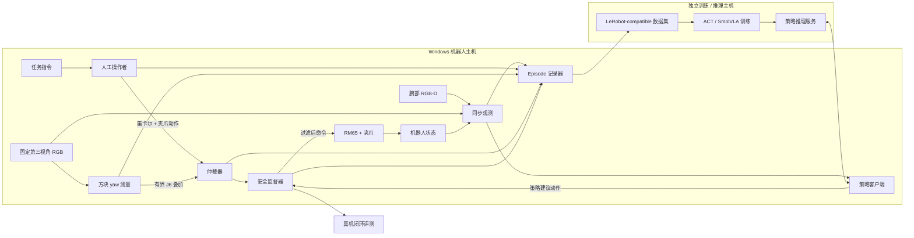

# SharedAutonomy-VLA 项目概览

语言：[English](overview.md) | 简体中文

SharedAutonomy-VLA 是一个真实机器人系统，用于研究：与纯人工遥操作相比，弱、局部的共享控制辅助是否能够产生更好的训练数据，并进一步训练出闭环表现更好的机器人策略。

公开方法主线是：

```text
人工示教（Manual 或 Shared Autonomy）
        → 结构化 episode 数据
        → 任务条件策略训练
        → 真机闭环评测
```

本项目定位为工程与方法验证，而不是声称简单方块任务必须使用 VLA，也不是预设 Shared Autonomy 必然普遍优于 Manual。

## 1. 项目重点

核心问题是：

> 在示教预算和训练配方相同的条件下，局部共享控制辅助能否提升由真实机器人示教数据训练出的策略的闭环表现？

系统始终让人类负责任务级运动和夹爪控制。辅助器被刻意限制在局部作用范围内：它对齐工具与目标方块的 yaw，不独立执行完整的抓取放置任务。因此，辅助采集器是数据生产阶段的“脚手架”，而不是最终策略。

该 benchmark 有意保持可控。传统视觉与控制系统也能够完成此类任务，因此本项目不把任务成功解释为“学习是必要的”。项目价值在于展示一条可检查的完整路径：遥操作与安全过滤、结构化记录、策略训练、真机部署和配对对照。

## 2. 公开主线

| 阶段 | 人类角色 | 机器角色 | 目的 |
| --- | --- | --- | --- |
| Manual 采集 | 控制笛卡尔运动和夹爪 | 不使用 yaw 辅助 | 数据与硬件基线 |
| Shared Autonomy 采集 | 控制笛卡尔运动和夹爪 | 估计方块 yaw，并叠加局部 J6 对齐 | 主要辅助数据条件 |
| 学习策略评测 | 正常控制回路中不再输入人工动作 | SmolVLA 根据观测和任务文本预测动作 | 检查数据是否支持自主执行 |

Shared Autonomy 采集器使用第三视角相机估计方块初始的 wrap-90 yaw。采集过程中，yaw assistant 提出有界的 J6 叠加控制；人类仍然负责平移和夹爪。人工覆盖、deadman 状态、夹爪状态、置信度、authority 和安全干预都会写入 episode 数据。

运行时 schema 也支持 corrective episode，但纠错再训练不是当前锁定的 Manual vs Shared Autonomy 主结果的一部分，而是后续扩展路线。

## 3. 任务与锁定对照

公开结果使用 `shape_pick_place_v1` 任务族的 `block_rotation_rq2` 评测变体：

```text
instruction: Pick up the red cube and place it in the UP region.
```

锁定对照是一个 36 条件的配对真机网格。完整条件矩阵、训练对照、硬成功规则和结果分析统一维护在 [`results.zh-CN.md`](results.zh-CN.md) 和 [`results.json`](results.json) 中；源数据事实和训练配方分别维护在 [`datasets.zh-CN.md`](datasets.zh-CN.md) 与 [`training.zh-CN.md`](training.zh-CN.md)。本 overview 只保留公开方法与架构，不重复结果表格和判定规则。

## 4. 系统架构



机器人主机负责硬件访问、观测同步、动作仲裁、安全过滤和发送给机器人的最终命令。训练和可选的策略推理可以运行在独立计算主机上；低层安全路径始终保留在机器人主机本地。

## 5. 运行时数据契约

每条 episode 都应能够区分：人类请求了什么、辅助策略提出了什么，以及机器人最终执行了什么：

- 同步的腕部和第三视角相机观测；
- 机器人状态，包括关节位置、末端状态和夹爪状态；
- `human` action；
- `assist` action 与 confidence；
- 经过安全过滤的 `executed` action、authority 和干预原因；
- task text、采集模式、时间戳、effective config、schema version，以及可用时的 source commit。

native recorder 保留物理空间动作和时间信息；训练导出再把 episode 映射为策略数据集格式。Overview 只说明这一边界；面向读者的数据契约和血缘摘要见 [`datasets.zh-CN.md`](datasets.zh-CN.md)。

## 6. 策略路线

ACT 作为早期 imitation-learning baseline 和管线支持路径保留。当前锁定的公开对照使用 SmolVLA，因为 Manual 与 Shared Autonomy checkpoint 都采用了这条语言条件策略路线。

部署时，学习策略接收视觉观测、任务文本和机器人状态，并提出动作序列。机器人主机在向硬件发送命令前，使用与系统其他部分相同的安全监督。目标是在正常控制回路中移除人类之后，评估策略的自主执行能力。

## 7. 硬件边界与安全

已验证的平台使用 RM65 类机械臂、两路相机、SpaceMouse，以及独立的 Windows 机器人主机和 Linux GPU 主机。公开硬件角色、主机职责、时序假设和完整安全边界统一维护在 [`hardware.zh-CN.md`](hardware.zh-CN.md) 中。机器专属值属于本机配置和私有联调备注。运动默认关闭，任何真机执行仍必须同时通过两个 motion gate，并由操作者确保急停路径可用。

## 8. 范围与限制

固定的单任务网格不能证明 Shared Autonomy 普遍更好、存在因果改进、具备重复性或广泛泛化能力，也不包含完整的 corrective-demonstration 结果。详细评测限制、负面结果和公开/私有边界统一见 [`limitations.zh-CN.md`](limitations.zh-CN.md)。对应的 private 代码、原始记录、机器路径和中间 checkpoint 不属于公开主线。

## 9. 公开实现入口

主要实现入口包括：

- [`cube_yaw_assist.py`](../sharedautonomy/assistance/cube_yaw_assist.py)：有界的局部 J6 yaw 辅助；
- [`safety_filter.py`](../sharedautonomy/assistance/safety_filter.py)：安全监督；
- [`schema.py`](../sharedautonomy/data/schema.py)：类型化的观测、动作和 episode 接口；
- [`recorder.py`](../sharedautonomy/data/recorder.py)：native episode 记录；
- [`policies/smolvla/`](../sharedautonomy/policies/smolvla/)：SmolVLA 运行时接口；
- [`results.json`](results.json)：锁定的公开评测协议和汇总结果。

代码使用 MIT License。数据集、模型 checkpoint、上游模型权重和媒体可能拥有单独的许可证与 attribution 要求；这些条件应在发布元数据中单独确认，不能默认沿用代码许可证。
