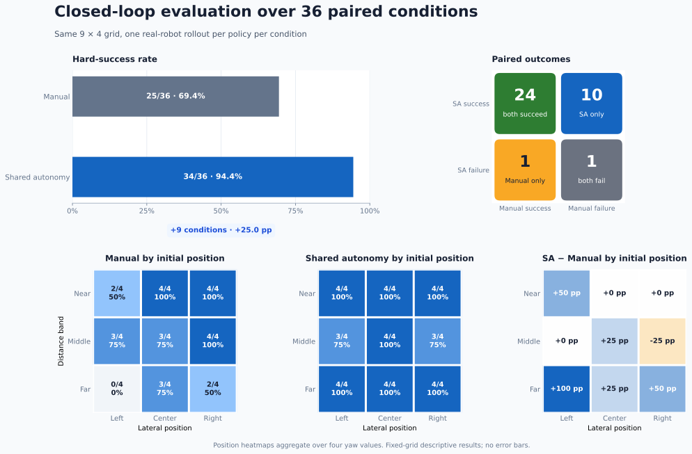

# Manual 与 Shared Autonomy 数据采集：闭环结果

语言：[English](results.md) | 简体中文

> 发布状态：数值记录和评测标签已经冻结。数据集、视频和 checkpoint 的外部发布当前暂缓；本文不声明外部 revision、checksum 或许可证。

## 结果摘要

在相同的 70 条示教预算和训练配方下，使用 Shared Autonomy 示教数据训练的策略在固定条件网格上取得 **34/36（94.4%）** 硬成功；使用 Manual 示教数据训练的策略取得 **25/36（69.4%）**。这是固定评测网格上的描述性差异：多成功 **9 个条件**，或 **25.0 个百分点**。

配对结果比单独比较总体比例更有信息量：两个策略共同成功 24 个条件，只有 Shared Autonomy 成功 10 个，只有 Manual 成功 1 个，两个都失败 1 个。最大差异出现在远距离区域：Shared Autonomy 为 12/12，Manual 为 5/12。



*图 1：总体硬成功率、配对条件结果，以及按四个初始 yaw 汇总的位置成功率热图。*

没有报告误差线或置信区间。每个策略在 36 个条件上各评测一次，因此这些比例描述的是固定的 `9 × 4` 网格，不代表重复试验方差或采样部署分布上的表现。

## 1. 评测协议

### 研究问题

本对照检验的是：在示教预算和训练配方保持一致时，Shared Autonomy 示教数据能否提高学习策略的闭环成功率。

Shared Autonomy 采集过程中，人类控制笛卡尔平移和夹爪，yaw assistant 控制 J6 对齐；Manual 采集不使用该 yaw 辅助。

### 对照策略与数据

| 项目 | Manual | Shared Autonomy |
| --- | ---: | ---: |
| 采集模式 | 人工遥操作 | 人控制 XYZ/夹爪 + J6 yaw 辅助对齐 |
| 示教数量 | 70 episodes | 70 episodes |
| 数据帧数 | 15,829 | 14,212 |
| 策略族 | SmolVLA | SmolVLA |
| 适配方式 | Expert-only | Expert-only |
| 训练步数 | 50,000 | 50,000 |
| 精度 | bf16 | bf16 |
| Batch 配置 | `8 × 2` | `8 × 2` |

两侧匹配 episode 预算，但因为 episode 时长不同，frame 数不完全相同。

### 任务与条件网格

稳定任务契约见 [`shape_pick_place_v1` 任务定义](tasks/shape_pick_place_v1.zh-CN.md)。

任务为 `Pick up the red cube and place it in the UP region.` 配对真机评测包含 9 个分类 XY 位置（`left/center/right × near/middle/far`）和 4 个 wrap-90 初始 yaw（`0°`、`22.5°`、`−22.5°`、`45°`）。每个策略 36 次，每个条件各一次；每个配对使用相同的物理布置。

公开记录只使用分类位置 ID，不包含现场精确坐标。

### 执行协议

- **执行方式：** 真机闭环 rollout；
- **尝试次数：** 每个策略 36 次，每个条件各一次；
- **配对方式：** Manual 和 Shared Autonomy 策略使用相同的条件布置；
- **安全：** 保持正常 motion gate 和本地安全监督开启；
- **判定方式：** 人工观察，并由 rollout 视频和 replay 记录辅助。

这是固定配对网格，不是部署分布的随机抽样，因此不能说明任意连续位置或任意 yaw 下的性能。

### 硬成功判定

硬成功要求夹爪跨越两个相对面形成抓取、将方块抬离支撑面、松爪后方块仍留在 `UP` 区域内，且没有安全急停。边缘抓取即使之后抬起或放置成功，也算硬失败。

只要满足硬成功条件，yaw 符号或角度不必完全准确，抓取位置不必完全居中，运动路径也不必完全平滑。非致命的 yaw 和 XY 偏差作为质量标记保留，不改变硬成功标签。

### 记录结果与分析规则

公开评测记录每个条件一行，包含分类位置和距离字段、初始 wrap-90 yaw、硬成功标签、每个失败 rollout 的一个主失败类型、质量标记和一条公开备注。完整记录见 [`evaluation_records.csv`](evaluation_records.csv)。

报告包含总体数量、配对结果、按距离/位置/yaw 的描述性切片和主失败类型数量。由于每个策略每个条件只有一次 rollout，不报告置信区间或误差线。

## 2. 结果

### 总体结果

| 策略 | 成功数 | 尝试数 | 成功率 |
| --- | ---: | ---: | ---: |
| Manual | 25 | 36 | 69.4% |
| Shared Autonomy | 34 | 36 | 94.4% |
| 描述性差异 | +9 | — | +25.0 个百分点 |

### 配对结果

| Shared Autonomy | Manual 成功 | Manual 失败 | 行总计 |
| --- | ---: | ---: | ---: |
| 成功 | 24 | 10 | 34 |
| 失败 | 1 | 1 | 2 |
| 列总计 | 25 | 11 | 36 |

在 11 个不一致条件中，只有 Shared Autonomy 成功 10 个，只有 Manual 成功 1 个。由于每个策略每个条件只有一次 rollout，该比较仍然是描述性的。

### 按距离的结果

| 距离区间 | Manual | Shared Autonomy | 差异 |
| --- | --- | --- | ---: |
| Near | 10/12 (83.3%) | 12/12 (100.0%) | +16.7 pp |
| Middle | 10/12 (83.3%) | 10/12 (83.3%) | 0.0 pp |
| Far | 5/12 (41.7%) | 12/12 (100.0%) | +58.3 pp |

总体差异主要集中在 Far 区间。这个切片适合诊断分析，但不能视为独立设计、具有足够统计功效的比较。

### 按初始位置的结果

图中的三个热图将四个初始 yaw 汇总到每个分类 XY 位置：

- 在 `left_far`，Manual 四个 yaw 条件全部失败，Shared Autonomy 四个全部成功（`0/4 → 4/4`）；
- 在 `right_far`，成功率从 `2/4` 提升到 `4/4`；在 `center_far`，从 `3/4` 提升到 `4/4`；
- Near 区域的 Manual 本来就较强：center 和 right 保持 `4/4`，`left_near` 从 `2/4` 提升到 `4/4`；
- `right_middle` 是 Shared Autonomy 唯一低于 Manual 的位置（`4/4 → 3/4`），新增失败是 `45°` 下的边缘抓取。

这些是每个位置四次试验得到的描述性比例，不足以支持有意义的误差线或位置级统计推断。

### 按初始 yaw 的结果

| 初始 yaw | Manual | Shared Autonomy | 差异 |
| --- | --- | --- | ---: |
| `0°` | 7/9 (77.8%) | 9/9 (100.0%) | +22.2 pp |
| `22.5°` | 7/9 (77.8%) | 9/9 (100.0%) | +22.2 pp |
| `−22.5°` | 7/9 (77.8%) | 9/9 (100.0%) | +22.2 pp |
| `45°` | 4/9 (44.4%) | 7/9 (77.8%) | +33.3 pp |

`45°` 是两个策略最困难的 yaw 切片。Shared Autonomy 的两次失败都是 Middle 区域的 `45°` 边缘抓取。

### 观察到的主失败类型

| 主失败类型 | Manual | Shared Autonomy |
| --- | ---: | ---: |
| Edge grasp | 5 | 2 |
| No grasp | 3 | 0 |
| No lift | 1 | 0 |
| Grasp slip or drop | 2 | 0 |
| **失败总数** | **11** | **2** |

主失败类型表示 rollout 失败时的主要原因。质量标记另外保留欠旋转、过旋转、旋转方向错误、到达误差、XY 偏移和多次抓取等观察。边缘抓取始终算失败，不能只作为质量标记。

## 3. 结果解释

在这个固定网格上，匹配 episode 预算和训练配方时，Shared Autonomy 示教数据训练出的策略取得了更高的闭环成功率。配对结果表明，差异不只是由两侧共同不稳定的条件造成：Shared Autonomy 恢复了 10 个 Manual 失败的条件，而反方向只有 1 个。

这个模式与 yaw 辅助在数据采集阶段的预期作用一致。最大差异出现在远距离位置，Shared Autonomy 剩余的两次失败都是 `45°` 边缘抓取。但这些仍然只是本实验中的诊断性关联，不能单独隔离因果机制，也不能说明固定网格以外的泛化表现。

更广泛的范围与解释限制见 [`limitations.zh-CN.md`](limitations.zh-CN.md)。

## 4. 可复现实验材料

- [`results.json`](results.json)：权威的机器可读协议、条件网格、汇总结果和发布元数据；
- [`evaluation_records.csv`](evaluation_records.csv)：36 个配对条件的标准化成功标签、主失败类型、质量标记和公开备注；
- [`datasets.zh-CN.md`](datasets.zh-CN.md)：锁定的数据集数量、公开数据契约、血缘和暂缓的发布元数据；
- [`training.zh-CN.md`](training.zh-CN.md)：锁定训练配方、去敏的 loss/gradient/learning-rate 曲线、checkpoint 选择和训练解释限制；
- [`../scripts/plot_evaluation_results.py`](../scripts/plot_evaluation_results.py)：直接根据 JSON 和 CSV 重新生成公开 SVG。

```bash
python scripts/plot_evaluation_results.py
```

本文档的数字表格和结果图均由 JSON 与 CSV 源文件生成。未来若补充外部数据集或 checkpoint 元数据，不应改变已经锁定的评测标签和汇总数量。
