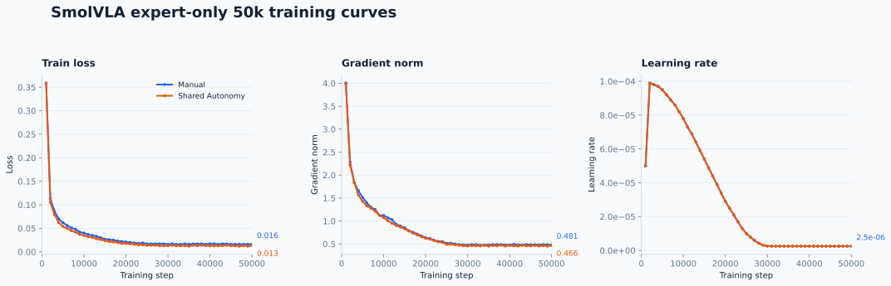

# SmolVLA Training: Manual vs. Shared Autonomy

Language: English | [简体中文](training.zh-CN.md)

> Status: This page records the training facts, public dataset links, public checkpoint links, and sanitized curves needed to interpret the locked comparison. Raw recordings, standalone private videos, raw logs, and local artifacts remain private.

## 1. Scope

This document records the two final expert-only SmolVLA training runs used by
the Manual-versus-Shared-Autonomy comparison. The training runs use the same
policy family and recipe while differing in the demonstration collection mode.

The corresponding closed-loop evaluation is documented in
[`results.md`](results.md). Training loss is not a substitute for that
evaluation: the training logs contain no validation split or validation loss.
The input dataset contract and release status are documented in
[`datasets.md`](datasets.md).

## 2. Locked training recipe

| Property | Manual | Shared autonomy |
| --- | ---: | ---: |
| Policy family | SmolVLA | SmolVLA |
| Adaptation | Expert-only | Expert-only |
| Training steps | 50,000 | 50,000 |
| Recorded precision | bf16 | bf16 |
| Batch configuration | `8 × 2` | `8 × 2` |
| Dataset episodes | 70 | 70 |
| Dataset frames | 15,829 | 14,212 |
| Evaluation split during training | `0.0` | `0.0` |

The model receives two RGB observation streams at `480 × 640` resolution and
a 10-dimensional state vector. It predicts a 7-dimensional action vector
with an action chunk size of 50.

The recorded policy initialization references:

- Base policy: [`lerobot/smolvla_base`](https://huggingface.co/lerobot/smolvla_base)
- Vision-language backbone: [`HuggingFaceTB/SmolVLM2-500M-Video-Instruct`](https://huggingface.co/HuggingFaceTB/SmolVLM2-500M-Video-Instruct)

These upstream identifiers are recorded for reproducibility. Their release
terms and attribution notices remain separate from this project code release;
the public checkpoint cards record the downstream Apache-2.0 release and
upstream provenance.

### Optimizer and scheduler settings

| Setting | Value |
| --- | ---: |
| Initial optimizer learning rate | `1.0e-4` |
| Optimizer betas | `0.9, 0.95` |
| Weight decay | `1.0e-10` |
| Gradient clipping norm | `10` |
| Warmup steps | `1,000` |
| Decay steps | `30,000` |
| Decay learning rate | `2.5e-6` |

## 3. Training telemetry

The plot below uses the 50 periodic metric rows recorded for each run, from
step 1,000 through step 50,000. It shows only training loss, gradient norm,
and learning rate.

*Figure 1. Training loss, gradient norm, and learning rate for the two final
expert-only runs. The endpoint labels are the last logged values.*

| Run | Last logged train loss | Last logged gradient norm | Last logged learning rate |
| --- | ---: | ---: | ---: |
| Manual 70 | `0.016` | `0.481` | `2.5e-6` |
| Shared autonomy 70 | `0.013` | `0.466` | `2.5e-6` |

The values above are training telemetry, not validation or deployment scores.
The `samples/sec` field is intentionally omitted from the figure because it
can vary with shared host/GPU load and is not a model-quality metric.

## 4. Checkpoint selection

The selected checkpoint for each run is the `050000` model artifact after the
final training step. The prepared artifact contains the model weights and
policy pre/post-processing artifacts required for inference.

The optimizer, scheduler, and random-state `training_state` are not part of
the prepared model artifact. The checkpoint can therefore be loaded for
inference or used as a new fine-tuning starting point, but it is not an exact
mid-run resume package.

Both final model artifacts were locally validated as readable and structurally
complete. They are not vendored in the GitHub repository; the public Hub
repositories are listed below. Their local paths are not published here.

| Run | Public checkpoint | License |
| --- | --- | --- |
| Manual 70 | [`zys1030/smolvla-block-rot-manual-70ep-50k`](https://huggingface.co/zys1030/smolvla-block-rot-manual-70ep-50k) | Apache-2.0 |
| Shared autonomy 70 | [`zys1030/smolvla-block-rot-sa-70ep-50k`](https://huggingface.co/zys1030/smolvla-block-rot-sa-70ep-50k) | Apache-2.0 |

## 5. Reproduction boundary

The published curve is a static, sanitized presentation asset derived from
private training telemetry. The raw logs and plotting input are not part of the
current public release, so this figure is not intended to be regenerated from
the public repository. Re-running the original training requires access to the
corresponding local datasets, the LeRobot/SmolVLA environment, and the original
training configuration.

## 6. Interpretation limits

- The two runs use matched episode counts and the same nominal training
  recipe, but their frame counts differ because episode lengths differ.
- There is no validation split in either run, so the curves do not establish
  generalization.
- The final closed-loop comparison is the fixed 36-condition evaluation in
  [`results.md`](results.md), not the final training loss.
- The experiment does not establish performance over arbitrary continuous
  positions, yaw angles, cameras, objects, robots, or deployment environments.
